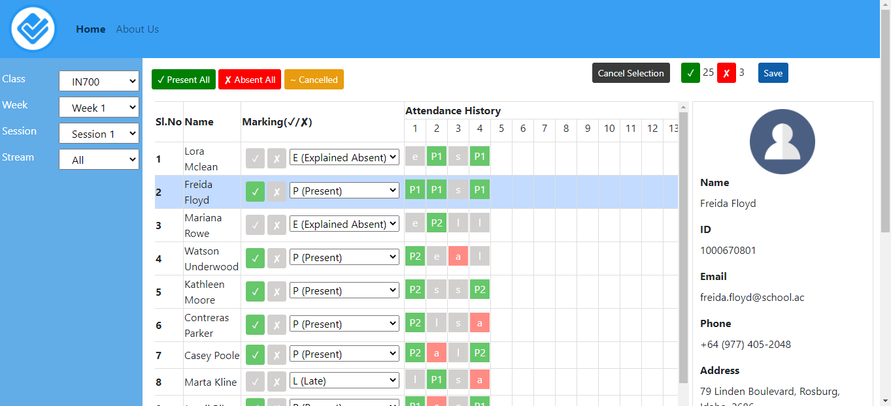

# Project Documentation
This project aimed at recording student attendance in lectures and labs at Otago Polytechnic. A lecturer can record whether a student attended a session and can edit and save the attendance details. The lecturer can track the overall attendance (how many sessions a student has attended). It is a serverless project (no back-end). Data is stored in the local storage.

## Home Screen

	

## Student Selection

	

